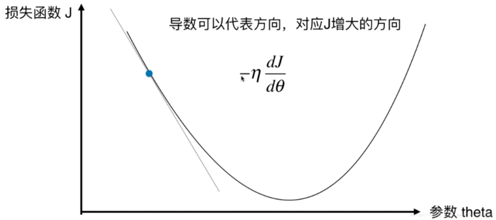
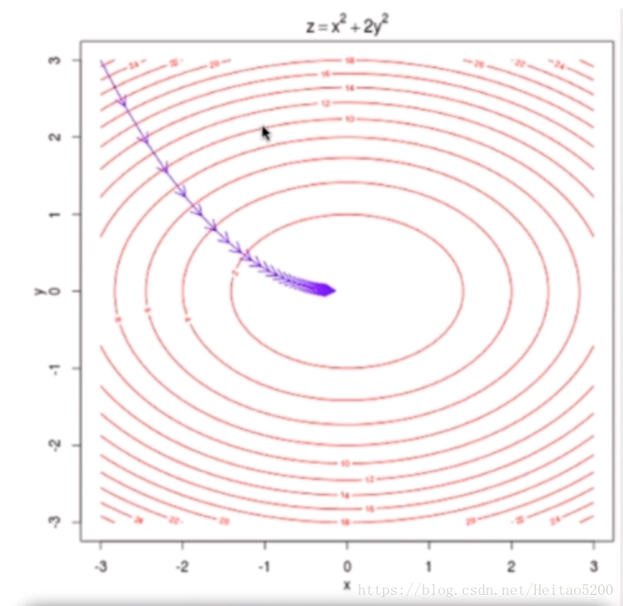

# 线性回归算法 

* 解决回归问题
* 思想简单，容易实现
* 许多强大的非线性模型的基础
* 结果具有很好的可解释性
* 蕴含机器学习中很多重要的思想

样本特征只有一个的线性回归问题，为**简单线性回归。**

样本特征有多个的线性回归问题，为**多元线性回归。**(由此可见，线性并不代表直线)

线性回归算法将无数的训练集数据放在一个坐标系中，以坐标系的一个维度作为label，其他维度作为特征，
最终会发现他们是沿着一条直线分布。线性回归算法的最终目的就是寻找出一条直线、一个面或者体(根据数据的维度而定)，
最大程度上"拟合"样本特征和输出label之间的关系。

特征是一维时，线性模型在二维空间构成一条直线；

特征是二维时，线性模型在三维空间中构成一个平面；

特征是三维时，则最终模型在四维空间中构成一个体；以此类推…

## 1 目标函数、损失函数、代价函数
* 损失函数（Loss Function ）是定义在单个样本上的，算的是一个样本的误差。
* 代价函数（Cost Function ）是定义在整个训练集上的，是所有样本误差的平均，也就是损失函数的平均。
* 目标函数（Object Function）定义为：最终需要优化的函数。等于经验风险+结构风险（也就是Cost Function + 正则化项）。

**注意**有的地方将损失函数和代价函数没有细分也就是两者等同的。

本文中**损失函数=代价函数**，目标函数是一个与他们相关但更广的概念，
对于目标函数来说在有约束条件下的最小化就是损失函数（loss function）[详情参见](https://www.zhihu.com/question/52398145)

## 2 简单线性回归算法思想

在简单线性回归中，我们将训练集特征作为横坐标，训练集label作为纵坐标，那么我们的最终目的就是
寻找出一条直线当给出新的特征时，
我们希望能够带入到中，求出预测值。

### 2.1 损失函数

#### 2.1.1 求损失函数最小化时候的 θ 参数
* [最小二乘法](http://www.cnblogs.com/pinard/p/5976811.html)

* [最大似然估计](http://www.cnblogs.com/pinard/p/5970503.html)

#### 2.1.2 目标函数(损失函数+正则项)
* L1正则化(L1范数)
   L1 正则化通常称为 Lasso 回归，它和一般线性回归的区别是在损失函数上增加了一个 L1 正则化的项，L1 正则化的项有一个常数系数 α 来调节损失函数的均方差项和正则化项的权重，具体 Lasso 回归的损失函数表达式如下：　　
    
   
    
    其中 n 为样本个数，α 为常数系数，需要进行调优。
   为 L1 范数。
   
   Lasso 回归可以使得一些特征的系数变小，甚至还是一些绝对值较小的系数直接变为 0。增强模型的泛化能力。
   
   Lasso 回归的求解办法一般有坐标轴下降法（coordinate descent）和最小角回归法（ Least Angle Regression）

* L2正则化(L2范数)
  线性回归的 L2 正则化通常称为 Ridge 回归，它和一般线性回归的区别是在损失函数上增加了一个 L2 正则化的项，和 Lasso 回归的区别是 Ridge 回归的正则化项是 L2 范数，而 Lasso 回归的正则化项是 L1 范数。具体 Ridge 回归的损失函数表达式如下：
  
  
  
  其中 α 为常数系数，需要进行调优。为 L2 范数。
  
  Ridge 回归在不抛弃任何一个特征的情况下，缩小了回归系数，使得模型相对而言比较的稳定，但和 Lasso 回归比，这会使得模型的特征留的特别多，模型解释性差。
  
  Ridge 回归的求解比较简单，一般用最小二乘法。

### 2.2 公式推导
找到a和b使得 尽可能小，
这是一个典型的最小二乘法问题：最小化误差的平方
损失函数是计算期望值和预测值的差值，期望其差值(也就是损失)越来越小

 

## 3 多元线性回归思想
在多元线性回归中，我们已经不能再简单地将训练集特征作为横坐标，训练集label作为纵坐标了，
但是我们的最终目的依旧是找到函数找到a和b使得 尽可能小，

当给出新的特征时，我们希望能够带入到 中，
求出预测值。

### 3.1公式推导(多元线性回归的正规方程解)

## 4 梯度下降法
* 梯度下降法不是一个机器学习算法

* 是一种基于搜索的最优化方法(优化目标函数)

* 作用:求目标函数的最小值
 
* 在求解机器学习算法的模型参数，即无约束优化问题时， 梯度下降（Gradient Descent）是最常采用的方法之一，
 另一种常用的方法是最小二乘法

### 4.1 梯度下降法简介
以下是定义了一个损失函数以后，参数 theta 对应的损失函数 J 的值对应的示例图， 
我们需要找到使得损失函数值 J 取得最小值对应的 theta（这里是二维平面，也就是说数据集的特征只有一个）， 在直线方程中，导数代表斜率； 在曲线方程中，导数代表切线斜率。这里导数即为梯度。

称为学习率，它是梯度下降法的一个超参数，它的取值反映获得最优解的速度，取值不合适时甚至得不到最优解。

### 4.2 梯度下降法求解(使损失函数尽可能小)
* 数据集处理

  每个样本增加一个特征
  
  <a href="http://www.codecogs.com/eqnedit.php?latex=\begin{pmatrix}&space;&(x_1^0)&space;&(x_2^0)&space;&\cdots&space;&(x_4^0)&space;&(y^0)\\&space;&(x_1^1)&space;&(x_2^1)&space;&\cdots&space;&(x_4^1)&space;&(y^1)\\&space;&&space;\cdots&space;\\&space;&(x_1^n)&space;&(x_2^n)&space;&\cdots&space;&(x_4^n)&space;&(y^n)&space;\end{pmatrix}&space;\Rightarrow&space;\begin{pmatrix}&space;&(x_0^0)&space;&(x_1^0)&space;&(x_2^0)&space;&\cdots&space;&(x_4^0)&space;&(y^0)\\&space;&(x_0^1)&space;&(x_1^1)&space;&(x_2^1)&space;&\cdots&space;&(x_4^1)&space;&(y^1)\\&space;&&space;\cdots&space;\\&space;&(x_0^n)&space;&(x_1^n)&space;&(x_2^n)&space;&\cdots&space;&(x_4^n)&space;&(y^n)&space;\end{pmatrix}" target="_blank"></a>
  
  有
* 求解方法
    * 代数法
    * 矩阵法(向量法)

  **二者步骤一样：**
  
  1.确定损失函数，求其梯度表达式
  
  **损失函数：**
  
  
  
  
  
  系数
  是为了方便求偏导
  
  **梯度表达式：**
  
  
  2.学习率乘以损失函数的梯度，得到当前位置下降的距离
  
  
  
  3.确定是否对于所有的 ​ 梯度下降的距离都小于 ​ ,如果小于 ​ 则算法终止，当前所有的 ​ 即为所求。
  
  4.更新 ​ ,其更新表达式如下。更新完毕后继续转入步骤 1.
  
  

* 机器学习算法的一种思路 

  通过分析问题，确定问题的损失函数，优化损失函数，获得机器学习的模型

### 4.3 三种梯度下降法(BGD、SGD、MBGD)
* 批量梯度下降法（Batch Gradient Descent）
  
  批量梯度下降法，是梯度下降法最常用的形式，具体做法也就是在更新参数时使用所有的样本来进行更新
  
  **更新公式：**
  
  

* 随机梯度下降法（Stochastic Gradient Descent）

  求梯度时没有用所有的 m 个样本的数据，而是仅仅选取一个样本 i 来求梯度
  
  **更新公式：**
  
  

* 小批量梯度下降法（Mini-batch Gradient Descent）

  小批量梯度下降法是批量梯度下降法和随机梯度下降法的折衷，也就是对于 m 个样本， 采用 x 个样本来迭代，1<x<m。一般可以取 x=10
  
  **更新公式：**​
  
  
  

## 5 在三维平面，数据集的特征有两个的情况：

### 5.1 注意
并不是所有的损失函数用梯度下降法都能够找到全局的最优解，有可能是一个局部最优解。 当然，如果损失函数是凸函数，梯度下降法得到的解就一定是全局最优解。

### 5.2 解决方案
* 多次运行，随机化初始点

* 梯度下降法的初始点也是一个超参数

* 设置合适的学习率。一般为0.01

## 6 线性回归模型评价标准:

[回归评价指标 MSE、RMSE、MAE、R-Squared](https://blog.csdn.net/skullFang/article/details/79107127)

skearn中使用的是R-Squared评价

GridSearchCV网格搜索出来的最优超参数使用的评价标准是GridSearchCV里面的score评分，并不是sklearn里面的score评分，sklearn采用的R_Squared评分

## 7 线性回归推广
### 7.1多项式回归
我们之前讨论的线性回归模型
都是x的一次方，如果增加二次方，那么模型就变成了多项式回归。这里写一个只有两个特征的 p 次方多项式回归的模型：

令

得：

这样我们就将不是线性回归的函数变成了线性回归的函数，这是一个五元一次线性回归。

### 7.2 广义线性回归
我们的输出 Y 不满足和 X 的线性关系，但是 lnY 和 X 满足线性关系，模型函数如下：

这样对与每个样本的输入 y，我们用 lny 去对应， 从而仍然可以用线性回归的算法去处理这个问题。我们把 Iny 一般化，假设这个函数是单调可微函数 g(.), 则一般化的广义线性回归形式是：

或者

这个函数 g(.) 我们通常称为联系函数。

## 8 参数详解

## 9 问题
1. 个人感觉，线性回归的可解释性比较好，大家会把他用作特征选择时的参考吗？具体怎么实现？
    * sklearn.LinearRegression().coef_属性结果是每个特征的系数，反应正负相关程度
2. 线性回归、Ridge回归（L2范式）、Lasso 回归（L1范式）的区别和适用条件；

3. 最小二乘法的算法复杂度怎么分析？

**在这次整理笔记中收获比较大的是清楚理解了3个问题：——布朗**

    1.定义损失函数的两种方法：最小二乘和极大似然；
    
    * 最小二乘：真实值和观测值的误差平方和
    * 极大似然：我们有一组样本(X,Y),需要估计一个参数theta,让出现(X,Y) 的概率最大； 这种情况下同样能推导出要求误差平方和最小
    
    2.求解代价函数有正规方程和梯度下降，二者比较明显的区别，正规方程是一次计算出结果，当特征量比较大的时候， 矩阵的逆计算量会很大， 这种时候梯度下降也能适合；
    
    3.为什么L1正则化可以产生稀疏模型（L1是怎么让系数等于零的），为什么L2正则化可以防止过拟合？
        
    对代价函数加入L1 和L2 相当于在正则化约束下求出代价函数取最小值的解；
    对于L1， 在二维平面上理解为一个矩形， 代价函数与矩形的顶点相交的概率比较大，所以w等于零的概率比较大，产生稀疏矩阵，特征选择
    代价函数加入L2, 在梯度下降的时候求得的w会比不加L2小，w越小越能避免出现过拟合情况   

## 10 实现代码
[线性回归算法Demo](../LR)

## 11 参考资料

[sklearn-GridSearchCV,CV 调节超参使用方法](https://blog.csdn.net/u012969412/article/details/72973055)

[Latex公式编辑手册1](https://www.zybuluo.com/codeep/note/163962)

[Latex在线编辑公式](http://www.codecogs.com/latex/eqneditor.php)

[机器学习算法 - 线性回归————Datawhale](https://blog.csdn.net/Datawhale/article/details/82931967)

[机器学习算法 - 线性回归————爖](http://note.youdao.com/noteshare?id=981825c617d47c10f4e0c373e8b7bfff)

[numpy.array的基本操作](https://blog.csdn.net/sinat_34474705/article/details/74458605)

[numpy.hstack和numpy.vstack操作](https://blog.csdn.net/m0_37393514/article/details/79538748)

[机器学习算法-线性回归——布朗](https://blog.csdn.net/hahayikeshu/article/details/82964574)

