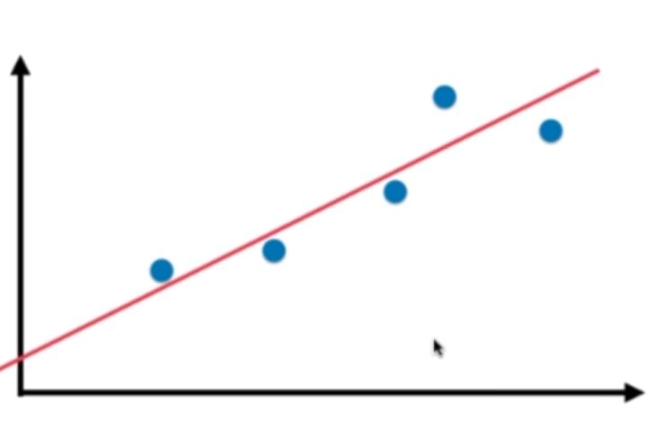
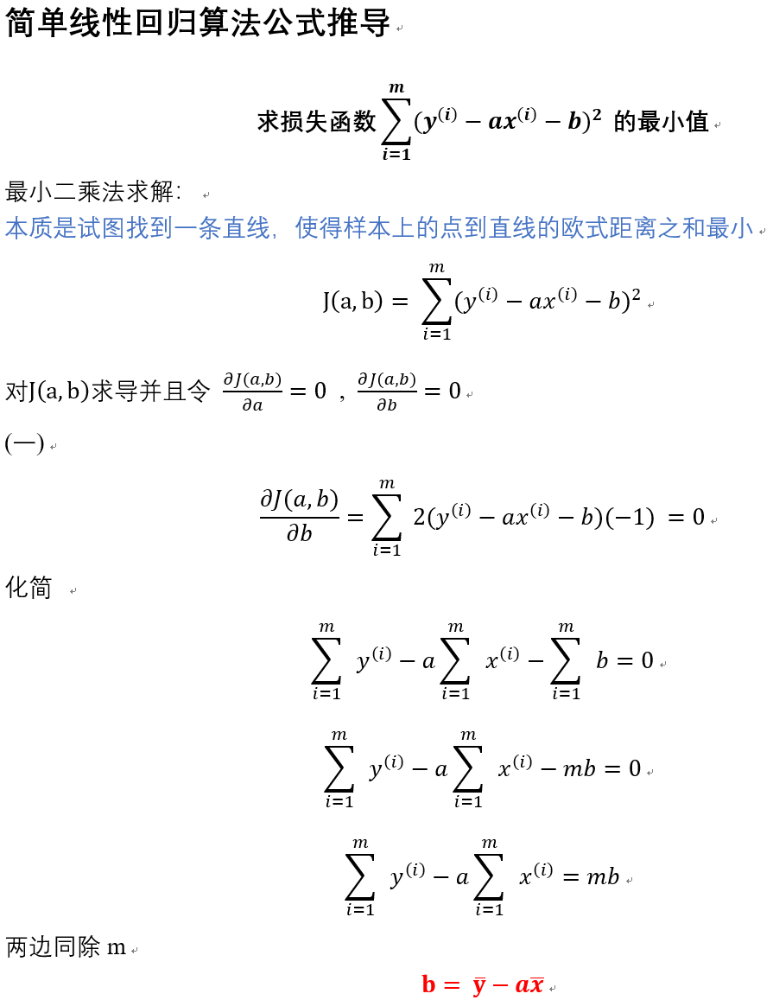
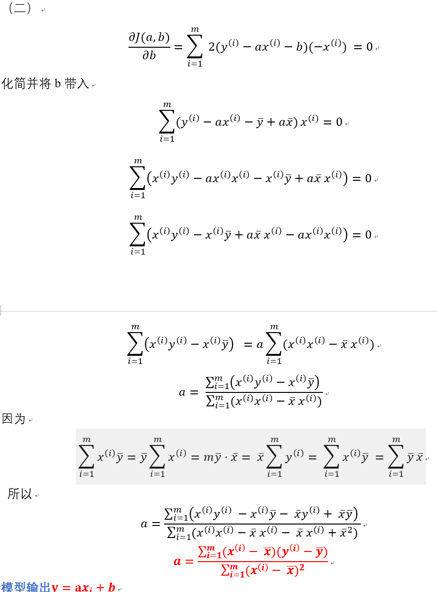
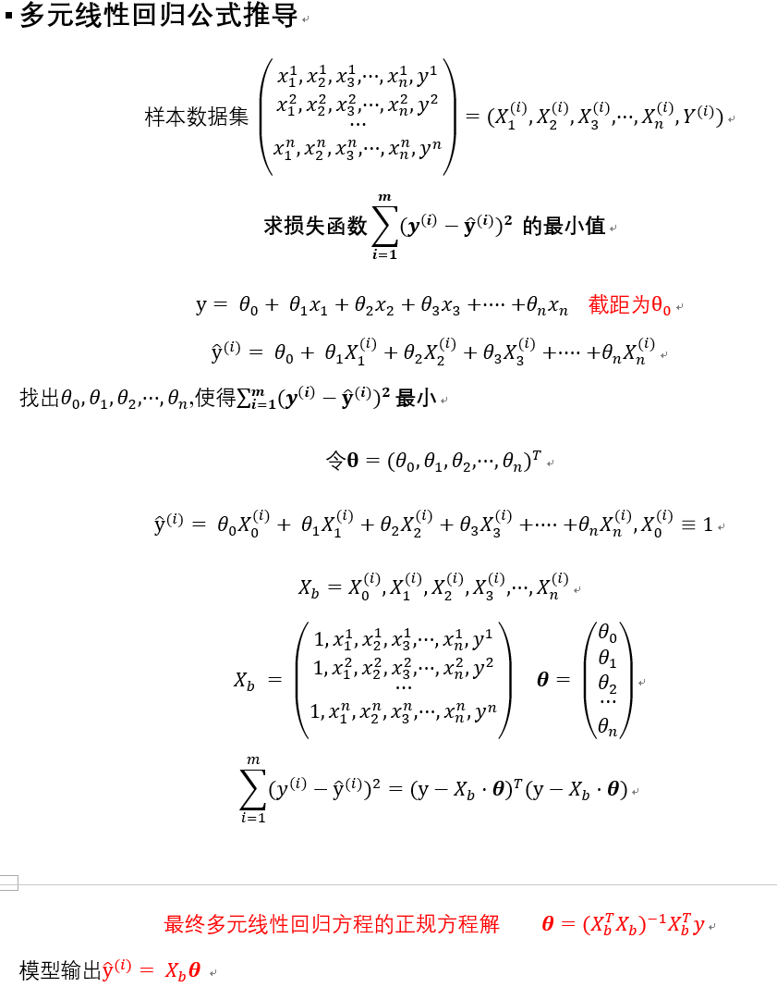
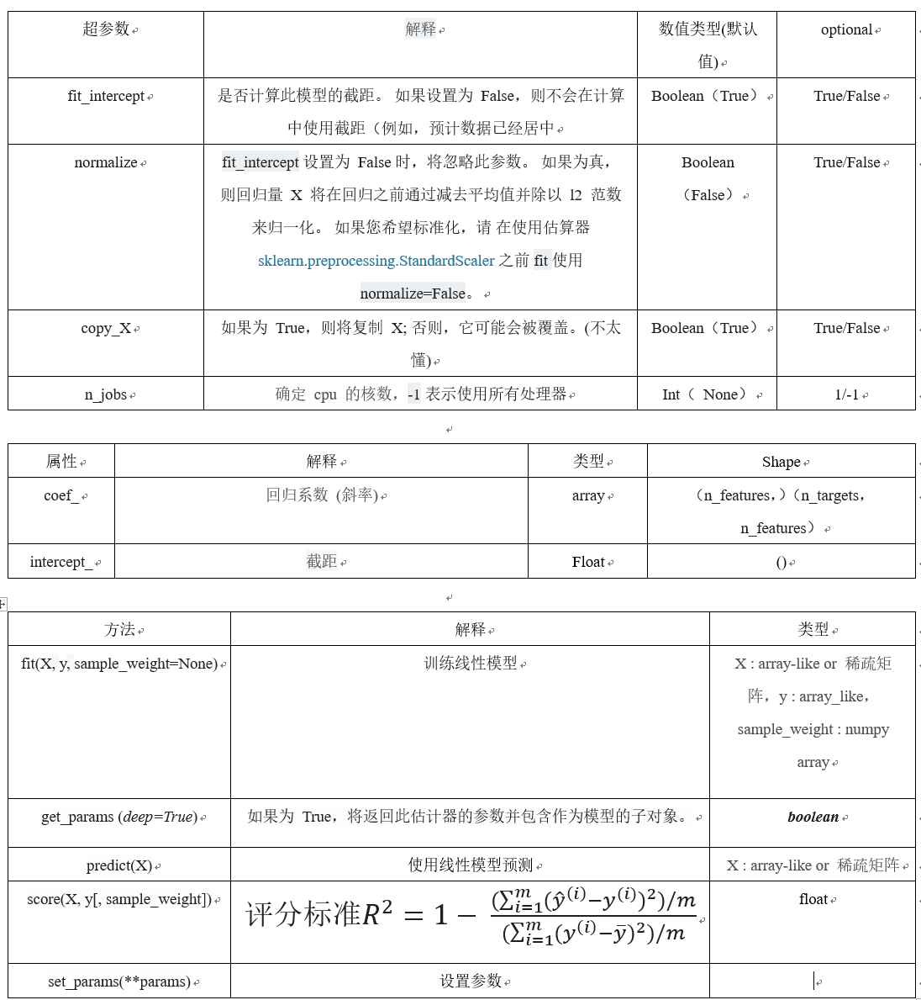

# 线性回归算法

$$ y =ax_i +b$$
* 解决回归问题
* 思想简单，容易实现
* 许多强大的非线性模型的基础
* 结果具有很好的可解释性
* 蕴含机器学习中很多重要的思想

样本特征只有一个的线性回归问题，为**简单线性回归。**

样本特征有多个的线性回归问题，为**多元线性回归。**(由此可见，线性并不代表直线)

线性回归算法将无数的训练集数据放在一个坐标系中，以坐标系的一个维度作为label，其他维度作为特征，
最终会发现他们是沿着一条直线分布。线性回归算法的最终目的就是寻找出一条直线、一个面或者体(根据数据的维度而定)，
最大程度上"拟合"样本特征和输出label之间的关系。

特征是一维时，线性模型在二维空间构成一条直线；
特征是二维时，线性模型在三维空间中构成一个平面；
特征是三维时，则最终模型在四维空间中构成一个体；
以此类推…

## 简单线性回归算法思想

在简单线性回归中，我们将训练集特征作为横坐标，训练集label作为纵坐标，那么我们的最终目的就是
寻找出一条直线当给出新的特征时，
我们希望能够带入到中，求出预测值。

### 公式推导
找到a和b使得 尽可能小，
这是一个典型的最小二乘法问题：最小化误差的平方
损失函数是计算期望值和预测值的差值，期望其差值(也就是损失)越来越小

 

## 多元线性回归思想
在多元线性回归中，我们已经不能再简单地将训练集特征作为横坐标，训练集label作为纵坐标了，
但是我们的最终目的依旧是找到函数找到a和b使得! 尽可能小，

当给出新的特征时，我们希望能够带入到! 中，
求出预测值。

### 公式推导(多元线性回归的正规方程解)

## [梯度下降法](https://blog.csdn.net/Heitao5200/article/details/82953725)
## 梯度下降法
* 梯度下降法不是一个机器学习算法

* 是一种基于搜索的最优化方法(优化目标函数)

* 作用:最小化一个损失函数

* 梯度上升法:最大化一个效用函数
 
* 在求解机器学习算法的模型参数，即无约束优化问题时， 梯度下降（Gradient Descent）是最常采用的方法之一，
 另一种常用的方法是最小二乘法

### 梯度下降法简介
以下是定义了一个损失函数以后，参数 theta 对应的损失函数 J 的值对应的示例图， 
我们需要找到使得损失函数值 J 取得最小值对应的 theta（这里是二维平面，也就是说数据集的特征只有一个）， 在直线方程中，导数代表斜率； 在曲线方程中，导数代表切线斜率。这里导数即为梯度。

## 机器学习算法的一种思路 
通过分析问题，确定问题的损失函数，优化损失函数，获得机器学习的模型

## 线性回归模型评价标准:

[回归评价指标 MSE、RMSE、MAE、R-Squared](https://blog.csdn.net/skullFang/article/details/79107127)

skearn中使用的是R-Squared评价

GridSearchCV网格搜索出来的最优超参数使用的评价标准是GridSearchCV里面的score评分，并不是sklearn里面的score评分，sklearn采用的R_Squared评分

## 参数详解

## 问题
1. 个人感觉，线性回归的可解释性比较好，大家会把他用作特征选择时的参考吗？具体怎么实现？
    * sklearn.LinearRegression().coef_属性结果是每个特征的系数，反应正负相关程度
2. 线性回归、Ridge回归（L2范式）、Lasso 回归（L1范式）的区别和适用条件；

3. 最小二乘法的算法复杂度怎么分析？

## 参考资料

[sklearn-GridSearchCV,CV 调节超参使用方法](https://blog.csdn.net/u012969412/article/details/72973055)

[Latex公式编辑手册1](https://www.zybuluo.com/codeep/note/163962)

[Latex在线编辑公式2](http://latex.codecogs.com/eqneditor/editor.php)

[机器学习算法 - 线性回归————Spareribs](https://www.jianshu.com/p/b37d0b84f576)

[机器学习算法 - 线性回归————Datawhale](https://blog.csdn.net/Datawhale/article/details/82931967)

[机器学习算法 - 线性回归————爖](http://note.youdao.com/noteshare?id=981825c617d47c10f4e0c373e8b7bfff)

[numpy.array的基本操作](https://blog.csdn.net/sinat_34474705/article/details/74458605)

[numpy.hstack和numpy.vstack操作](https://blog.csdn.net/m0_37393514/article/details/79538748)