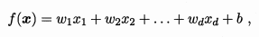
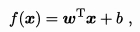

# 机器学习算法 --- 线性回归

## 简介
线性回归是利用数理统计中回归分析，来确定两种或两种以上变量间相互依赖的定量关系的一种统计分析方法

其表达形式为

其向量形式为

b为误差服从均值为0的正态分布。
简单回归分析中，只包括一个自变量和一个因变量，且二者的关系可用一条直线近似表示，
这种回归分析也称为一元线性回归分析。

如果回归分析中包括两个或两个以上的自变量，且因变量和自变量之间是线性关系，则称为多元线性回归分析。

